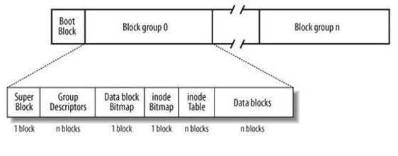

In this project, you'll finish the implementation of a program that
understands the on-disk format of a Linux "ext2" filesystem walks
through its directory hierarchy to read some files. We've provided
most of the code for you, but we have omitted the implementation of
some key functions.  Your job is to fill in the omitted code.

To help you know whether or not your code is correct, we've provided
you with a bunch of test code that examine the data structures and
file content retrieved by your code, and compares them to the
known-to-be-correct values. Once your code passes all of our tests,
you're done! If your code fails some of our tests, you can look at the
tests and the expected values they print out, to help you diagnose
your errors.

# Understanding ext2

In this section of the project web page, we'll give you a good enough
understanding of the ext2 filesystem to finish the project.  If you're
curious for more information, there are several books and web pages
that discuss the ext2 file system in gory detail; for example, see see
chatper 9.1 of [The Linux
Kernel](https://www.tldp.org/LDP/tlk/fs/filesystem.html),
or [this very detailed doc](https://www.nongnu.org/ext2-doc/ext2.html).  
ext2 (the "second extended filesystem") has a data structure and
on-disk layout that is similar to (but more complicated than) the
idealized filesystem we covered in class.  Here's a picture describing
ext2's on-disk layout:

At one level, an ext2 filesystem is just a series of blocks on disk,
starting with block 0 and ending with block N, where N = (disk\_size /
block_size) - 1. The block size of an ext2 filesystem is a parameter
chosen when the filesystem is formatted: you shouldn't assume any
particular blocksize, though in practice you'll typically encounter
1024 byte or 4096 byte block sizes. So, if you need to fetch block 5
off of the disk, you'd fetch <i>blocksize</i> bytes starting from
offset <i>5*blocksize</i> on disk. 

At a different level, ext2 splits the disk into an initial boot block
that the BIOS of the computer fetches and executes during the boot
process, followed by a series of "block groups." A block group is a
set of adjacent blocks.  Blocks within the same block group tend to be
spatially close to each other on the disk, and therefore quick to seek
between.  Blocks in different block groups might be very far apart. In
ext2, each block group has a fixed size, selected at the time the
filesystem is formatted.

Each block group is split into a set of sections:

- the *superblock* is the first block within each block group.  It
  contains a bunch of metadata describing the file system, such as the
  block size, the number of blocks in a block group, and other
  information. Each block group in an ext2 filesystem contains a copy
  of the superblock.  (Note that in later revisions of ext2, fewer
  copies of the superblock were made, but for this project you can
  assume the superblock exists as the first block of every block
  group.)

- the *group descriptor table* occupies some integral number
  of blocks following the superblock.  The group descriptor table
  contains one descriptor entry for each block group in the
  filesystem. A descriptor entry describes various things about its
  associated block group, including the block number at which its
  inode table begins.  Descriptor entry 0 refers to block group 0,
  descriptor entry 1 to block group 1, and so on.
  
  If there are N block groups in the file system, there will be N
  group descriptors entries in the group descriptor table.  Since a
  group descriptor has a known size (32 bytes), you can use the
  information in the superblock to calculate how many block groups
  there are, and therefore how many group descriptors there are, and
  therefore how many blocks the group descriptor table occupies.
  
  Each block group in the file system contains a full copy of the
  group descriptor table.

- the *data block bitmap* is a bitmap that indicates which
  of the data blocks within this block group have been allocated, and
  which are free for allocation.  You won't be accessing or using this
  bitmap in this project.

- the *inode bitmap* is a bitmap that indicates which of the
  inodes within this block group have been allocated, and which are
  free for allocation.  You won't be accessing or using this bitmap in
  this project.

- the *inode table* is an array of inodes.  Each inode
  occupies 128 bytes.  The structure of an inode is roughly what we
  covered in class; you'll dig into the details during your
  implementation.  An inode of a file contains the file's type
  (e.g., directory vs. regular file), the size of the file's data,
  pointers to direct data blocks, a singly indirect block, a doubly
  indirect block, and a triply indirect block.

  The superblock tells you how many inodes there are in a block group,
  and given this, you can calculate how many blocks the inode table
  occupies.

- the *data blocks* section is an array of data blocks used
  to store files' content.

## Directories

In ext2, a directory is just a file that happens to contain specially
formatted data. A directory file contains a linked list of
variable-sized directory entries. Each entry in the directory contains
an inode number for that entry, a filename for the entry, and an
offset to the next entry in the linked list. So, by reading the
contents of a directory file, you can find out the names of files
within that directory, as well as the inode numbers for those
files. Note that every directory contains two special entries, one for
the "." file (the current directory), and one for the ".." file (the
parent directory).

For detailed information about what a directory file looks like in
ext2, [look
here](https://www.nongnu.org/ext2-doc/ext2.html#linked-directories).

There are two details you may encounter.  First, when a file is
deleted from a directory, it's possible that the directory file itself
is not repacked to fill the gap, but rather a "hole" gets created in
the directory file where the deleted file's directory entry used to
live, and the linked list structure will jump over the hole.

Note that there is a second directory format (the so called Indexed
Directory Format) for directories with tons of files.  Our system
won't support that.

## Inodes

An inode in EXT2 is 128 bytes long, and contains many different
fields.  For this project, we only care about a few of them:

- the *i_size* field indicates the number of bytes stored
  in the file, i.e., the file's length.

- the *i_block* array is an array of 15 block numbers.
  * The first 12 entries in the array (i_block[0] through i_block[11])
    contain the block numbers of direct blocks: they name data blocks
    that contain the first 12 blocks worth of the file's content.
  * The 13th entry in the array (i_block[12]) contains the block
    number of a singly indirect block:  it names a block that contains
    an array of 4 byte block numbers; each of these blocks contains
    additional file contents.

  * The 14th entry in the array (i_block[13]) contains the block
    number of a doubly indirect block:  it names a block that contains
    an array of 4-byte block numbers, each of these blocks in a singly
    indirect block, that contains an array of 4-byte block numbers of
    direct blocks.

  * The 15th entry in the array (i_block[14]) contains the block
    number of a triple indirection block.

## Summary

This is basically everything you need to understand about how
EXT2 lays out its data on disk.  Let's dive into the implementation,
picking up additional details as needed...

# Finishing our implementation

## Getting familiar with the code we've given you

First, checkout the source code for our partial implementation.  Poke
around in the source code to get a general idea of its structure.  The
"main()" function lives in <tt>testcode.c</tt>.  The bulk
of the program lives in <tt>ext2access.c</tt>; you'll be
adding code to functions in that file.  The <tt>inc/</tt>
directory contains header files that declare in-memory structures used
by the file system code.

Second, compile the program with "make".

Finally, try running the <tt>testcode</tt> program.  You'll need to
pass an argument that is the name of a file containing a valid ext2
file system image.  We've provided such an image for you in
<tt>451_filesystem.ext2</tt>.  So, to
run the program, issue the command:

    $ ./testcode 451_filesystem.ext2

	metadata tests...
	 - 'fsm->disk_size' == 53248000  OK [+1 pt]
	 - 'fsm->block_size' == 1024  failed! (was 33554432)
	 - 'fsm->num_blocks' == 52000  failed! (was 32558)
	
	blockgroup descriptor table tests...
	 - 'bgdt[0].bg_free_blocks_count' == 6288  failed! (was 0)
	 - 'bgdt[num_descriptors_in_table-1].bg_free_blocks_count' == 1973  failed! (was 0)
	
	fetch_inode() tests...
	[1]    2862 segmentation fault (core dumped)  ./testcode 451_filesystem.ext2
	

Note that the program will print out the results of our test code, and
that the test code assumes you're running the program against the
<tt>451_filesystem.ext2</tt> image.  Because some of the
implementation is missing, the program in its current, unfinished
segfaults.  As you get more of the implementation working, you'll get
further through its execution, and see more of the tests and their
results.  Eventually, when you have your implementation fully working,
it will print out how many total points your implementation has
earned.

The 451_filesystem.ext2 file does contain a mountable file system
image; if you were to write the contents of this file into a raw hard
drive, you'd be able to mount it from your computer.

Even better, you can mount the file as a disk on your linux vm.  This
is strictly optional but here's the commands to do it:

    mkdir /tmp/myext2disk
    sudo mount -o loop -t ext2 451_filesystem.ext2 /tmp/myext2disk
    ls /tmp/myext2disk

Just don't edit anything as it will break the tests which assume this
particular file configuration.  When you're finished poking around,
type "sudo umount /tmp/myext2disk" to unmount the file.

## load\ext2\_metadata
 
### Loading the superblock

Let's get going with the code.  Begin by opening up the file
<tt>extaccess.c</tt> in your favorite editor.  This file is where you
will be spending the bulk of your time in this project.  The first
function defined in this file is load\_ext2\_metadata this function
will read the superblock stored in the first blockgroup of the disk
image into memory, and even better, into a "struct os_superblock_t"
structure.  This structure is defined in <tt>inc/superblock.h</tt>.

The first issue is that they data we need is located at byte 1024 of
our source file.  To a certain size of data at a particular location
we need to use lseek and read.  Lseek (when used with the SEEK_SET
parameter) moves the file read to a particular position.  read reads a
certain number of bytes into memory.  Something like this:

    lseek(fd, my_file_offset, SEEK_SET);
    read(fd, my_memory_location, my_data_size));

But how do we parse that raw data into all its many many fields?
We'll use a trick.  The os_superblock_t struct is designed to exactly
mirror the way the data is being stored in the disk image.  As a
result, if we load the raw disk image data into the address of a
os\_superblock_\t variable, we can access the individual fields of the
structure without having to manually parse the data.

This trick makes some strong assumptions about how the compiler lays
out C structs in memory.  This isn't always safe to do, but we've
verified that our implementation works on Linux and Mac OS X on x86
machines.

One you get this working the metadata and blockgroup descriptor tests
should pass.

### calc\_metadata

The out of the function is supposed to be a struct os\_fs\_metadata\_t
object.  This is constructed using the superblock data, but
transformed slightly to make it easier to work with.  Take a look at
the commends and code in calc\_metadata but you shouldn't need to edit
anything if you've done the previous part correctly.

## Implement fetch\_inode()

Given an inode number, fetch\_inode() should read the associated inode
off of disk into a "struct os\_inode\_t" structure passed to the
function by the caller.  (Note that the caller passes a pointer to an
already-allocated structure as an argument to fetch\_inode(), so you
don't need to malloc anything inside fetch_inode() itself.)

The hard part in implementing this function is figuring out where the
inode with a given inode number actually lives on disk.  We've provided
a lot of hints on how to figure this out...just follow the steps we've
laid out.  Here's a potential stumbling block you should avoid falling
prey too:  the first inode in the filesystem has inode number 1, not
inode number 0.  (Bleah!)

"struct os\_inode\_t" is defined in <tt>inc/inode.h</tt>.
You'll want to familiarize yourself with it.

As before, compile and run testcode until you pass all of our tests
for this function.  As calibration, our implementation has about 14
lines of code.

## Finish the implementation of calculate_offsets()

calculate_offsets() accepts the block number to read from a file,
and figures out whether that block number is accessed through one
of the 12 direct blocks in the inode, or through the single
indirection block, or through the double indirection block, or through
the triple indirection block.  If it should be accessed through
indirection blocks, it figures out the indexes into those blocks to use.

This code is pretty tricky, but it's useful to get a sense for what
it's doing and what's involved with getting it right.

We've given you the start of this code, but we've left the cases for
double indirect blocks and triple indirect blocks for you to do.

As calibration, our implementation of the missing piece has about
10 lines of code.

## Read through file\_blockread()

file\_blockread() will read a block from a given file off of the file
system into memory.  The caller passes in an inode for the file it
wants to read from, and the block offset within that file to read.
For instance, if the blocksize is 1024 bytes, then to read bytes
0-1023 from the file, the caller would pass in block offset 0.  To
read bytes 1024-2047 from the file, the caller would pass in block
offset 1.

file\_blockread() uses the offsets and indexes calculated by
calculated\_offsets() to do the actual reading.  The only real
complication is that ext2 supports the notion of "holes" in files:
ranges of a file that logically exists containing zeroes, but which
don't have any physical data blocks allocated to store the zeroes.

We've coded this function for you. Read through the implementation to
get a sense of how it works, and make sure you understand the
interface to this function -- i.e., how to invoke it, what the
arguments mean, and what gets returned by the function on success or
failure.

## Implement file\_read()

file\_read() will read the full contents of a file from disk into
memory.  The caller passes file\_read() the inode number of the
file it wants to read, and file\_read() will:

- convert the inode number into a "struct os\_inode\_t" using
  fetch\_inode(),
- allocate space for the full contents of the file,
- loop through the blocks of the file, using file\_blockread() to
  read them into memory.

As before, compile and run testcode until you pass all of our tests
for this function.  As calibration, our implementation has about
22 lines of code.

## Implement scan\_dir()

Given the contents of a directory file, the length of the directory
file, and a file name, this function scans through the directory file
looking for a directory entry that matches the file name.  If it finds
one, it returns the inode number for that file name.  If it doesn't,
it returns 0.

You'll need to understand some details about the structure of
directory entries within a directory file to implement this function
correctly.  Take a look at the comments in scandir for details.

As before, compile and run testcode until you pass all of our
tests for this function.  As calibration, our implementation has
about 15-20 lines of code.

You're almost done now...

## Implement path\_to\_inode\_num()

The final piece we need is a way looking a particular file's inode
based on a absolute directory path.  Eg. take a string like
"/foo/foo2/bar.txt" and say that file's inode is 44.

To do this we need to start at the root the filesystem, load the
directory there, find the first element of the path in our structure
within the directory data, load the directory there, etc.

All of the individual steps are already written, but they have to be
tied together.  We also put some hints in the function itself.  For
reference, our solution is about 20 lines of code.  Use unit tests to
verify as usual!

# A Working Tool

Now that you've gotten the functions in ex2access implemented, it's
now simple to build a tool that allows access to arbitrary files on an
ext2 filesystem.

Take a look at the filereader application the makefile already built
for you.  You should be able to invoke it like this, using any file
path in the ext2 filesystem as an input:

    $ ./filereader 451_filesystem.ext2 /small-file.txt
    file at inode 15
    outputing file named small-file.txt...

The utility creates a file in your local directory that contains the
contents of the file extracted from the ext2 filesystem.

Thats it!  If we wanted to we could expand these functions to allow
writing, support edge cases of the ext2 spec that we ignored etc.  But
hopefully this by itself was enough to show you that implementing a
real filesystem is a tricky but eminently doable affair...

# Valgrind

Several of the functions allocate memory so we should be sure to get
it run.  Run valgrind on your solution to ensure memory correctness.

# Turning in

Submit your ex2access.c

# Rubic

|                   | Points | Notes |
|:------------------|--------|-------|
| passes test cases | 91     |       |
| filereader works  | 4      |       |
| valgrind passes   | 5      |       |

# Acknowledgement

This assignment was originally written by Steve Gribble for the
University of Washington.  It has been modified in various particulars
for the Rose Hulman context by Mike Hewner.
