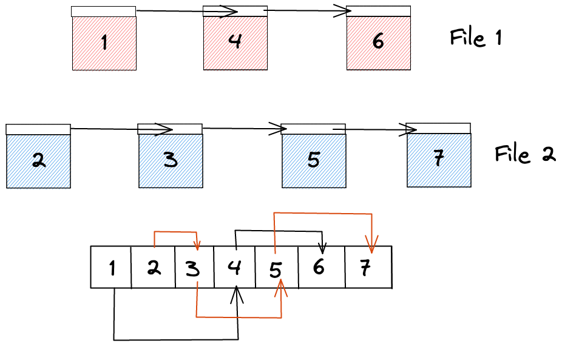

# Leaning Objectives

At the end of this lecture, you should be able to:

- Define the services that a filesystem offers and how they can be organize.

- List different filesystem organization strategies.

- Identify advantages and disadvantages of each organization strategy.

---

# Topics

- Filesystem organization.

- File Allocation Table (FAT).

- I-nodes.

---

# Notes

# Introduction

- Files are an essential part of the services provided by the operating system
  - In Linux, everything is a file
- Memory is good, but we need to go beyond memory into the concept of files that
  represent blocks or streams of data
  - Most importantly, all processes need to be able to store files persistently
  on the machine
  - i.e., they must be able to access them later without rewriting everything

## Requirements

- A storage system must meet the following requirements:
  1. It must be able to host a very large amount of data
  2. The data must persist even after the process that created it is destroyed
  3. Multiple processes must be able to access the information simultaneously
     (with some constraints)

- Disks are the natural storage systems that provide us with the above
  requirements

- It is the job of the operating system to act as a **glue** and manage the
disk and access to the disk from users and processes

## Overview

## Some Definitions

- **Question:** How would define a file?
    - A file is a logical unit of information, created by a process
- Let's look at how the OS organizes files
- A disk can be divided into **partitions**
    - The first partition is called the Master Boot Record (MBR)
        - It is used to boot the computer initially
        - At the end of the MBR is the partition table

## The Boot Cycle

## The Crux

- The most important question that we would like to answer is **how do we
  allocate disk blocks to files?**

- We will explore four techniques:
  1. Contiguous allocation.
  2. Linked list allocation.
  3. File Allocation Table (FAT).
  4. Inodes or index nodes.

# Contiguous Allocation

- In contiguous allocation, we store each file a contiguous stream of disk block
  - e.g., a 50KB file would require 50 **contiguous** 1 KB blocks to be stored
    

## Advantages

- Can you think of any advantages to this approach?
- Very simple to implement
- We only need to know the starting block to find any block in the file
  - If I know the first, then the 50th block is simply 50 block forwards

## Disadvantages

- What problems can you foresee with this approach?
  - *Fragmentation*:
    - Consider that we delete files 2 and 4 from the diagram above
    - We want to allocate now file 5 that needs 3 blocks of data
    - What happens then?
      - We have the room for file 5, but they are not contiguous
    - Disk is now a bunch of files and holes
    - Defragmentation is expensive, so we must try to avoid it as much as we can
    - Need to know the size of the entire file before we can store, cannot have
    dynamic file allocation
      - Imagine a word processor this way, it would suck!

# Linked list

- What dynamic data structure replaces an array?
    - Yes a linked list
- In linked list allocation, each block contains a pointer to the next block in
the file
    

    
## Advantages

- No external fragmentation, we can use any open spot in the disk

- We only need to know the first block in a file to have access to the full blocks in the file

## Disadvantages

- Accessing a file randomly is very **slow**
  - Imagine we want to access blocks 5 and 150 from a certain file
  - We'd have to traverse the entire linked list only to get two blocks

- Each block will have to store some metadata and a pointer to the next block
  - The block size is no longer a power of two
  - Freak out!!!!!

# File allocation table (FAT)

- Can we do any better than storing the pointers to the next block inside each
  block?
- Yes, put the logical linked list in memory, and the actual blocks on disk
- Traversing the file is now much faster since the linked list is now in memory
    - Only fetch the blocks that you need after traversing the table
    

    
## Problems

- The FAT table must be in memory at all time.
- We must keep the information about each file even if we do not currently need
  it.
  - size limit on the size of the FAT table as well as the size of the physical
  disk.

### Index nodes (inodes)

- Let's make this better
- Now, we store for each file an **index node** (or `inode`)
  - It is a data structure that contains file attributes, author information,
    access rights, etc.
  - Most importantly, it contains the addresses of the file's blocks
- `inodes` are stored on disk, unless they are actually needed
  - So keep information in memory only about the active files

- The main advantage is that the `inode` table is much smaller than the FAT

- The size of an `inode` block is proportional to the file size and not to the
  disk size

