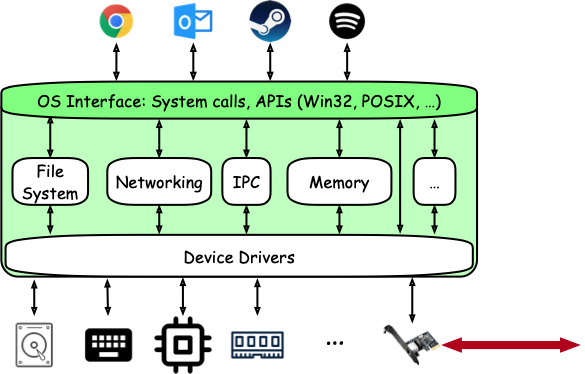

# Learning Objectives

At the end of this lecture, you should be able to:
- Define the roles of an operating system (OS). 
- Identify the services of an OS and classify them into its different roles. 
- Define a system call and use it in a C programming environment. 

---

# Topics

In this lecture, we will cover the following topics:
- The OS as an illusionist.
- The OS as a referee.
- The OS as glue.
- System calls.

---

# Notes

<!-- vim-markdown-toc GFM -->

* [Introductions and Syllabus Time](#introductions-and-syllabus-time)
* [Story Time: The Norse Creation Myth](#story-time-the-norse-creation-myth)
* [The Operating System](#the-operating-system)
  * [Definition(s)](#definitions)
  * [The Roles of an OS](#the-roles-of-an-os)
    * [The OS as an Illusionist](#the-os-as-an-illusionist)
    * [The OS as a Referee](#the-os-as-a-referee)
    * [The OS as a Glue](#the-os-as-a-glue)
* [Summary](#summary)

<!-- vim-markdown-toc -->

# Introductions and Syllabus Time

- ➡ Pick up from where we left off yesterday with pointer
  arithmetic. 
- Some time for introductions.
- Syllabus Information:
  - Lectures and Activities.
  - Lab assignments.
  - Challenge assignments.
  - Exams: two exams and no final.
  - Grade distribution.
  - Project.

# Story Time: The Norse Creation Myth

- Here's an image that sums up the Norse creation myth:

  

- ❓How is this relevant?
- We will focus on how Odin and his brothers created humans. 
- Giving them limbs and organs (hardware and resources) is not enough, they need
  a way to manage and use those resources in the most efficient way possible. 

# The Operating System

- Below are some useful quotes about operating systems.

> It has been said that the principal function of an operating system is to
  define a number of different names for the same object, so that it can busy
  itself keeping track of the relationship between all the different names. -
  David Clark, RFC 814.

> The operating system is a piece of software the gets sh** done. - Your
  instructor, when thinking about this lecture. 

## Definition(s)

- ❓ Why would you design a processor? What are the benefits that you
  can gain from designing a processor or a computer?
- For a processor or a computer to be useful, we need to be able to run programs
  on it. And hopefully, run many of those programs at once. 
- The operating system is the piece of software the resides in-between your
  software applications and your hardware components, and that allows
  applications to run on the processor and give meaningful results. 

  

- The OS provides the following services to the users:
  1. Initialization: After the bootloader has finished loading it, the OS will
     take care of making the correct enchantments to summon the right services
     so that you can use your machine. 
  2. Process (program) management: The OS is what manages the different
     processes that you have running on your machine, in terms of access to the
     processor, access to memory, access to hardware, etc.
  3. System calls: The OS allows programs to interface with the hardware and the
     outside world through the use of system calls. 
  4. Interrupt handling: The OS takes care of processing interrupts and
     exceptions and making sure that appropriate action is taken based on which
     type of interrupt is triggered. 
  5. Input/Output operations: The OS is in charge of providing the user with
     services to handle input from the keyboard, mouse, network, etc. It also
     provides services to write to output devices, such as the monitor, the
     sound card, etc. 
  6. File management: The OS is what provides the necessary abstractions needed
     to implement and manage file by organizing them, setting up access rights,
     and so on. Fun fact: everything is Linux is a file. 
- In short, the OS takes care of transforming the ugly world of hardware into
  the masterpiece that is modern machines. 


## The Roles of an OS

- Another way of looking at the roles of an operating system is through the lens
  of three main roles it must play:
  1. The OS as an illusionist.
  2. The OS as a referee.
  3. The OS as glue. 

### The OS as an Illusionist

- Much like our creation story, it is the job of the OS to give each program the
  __illusion__ that it owns the entire machine and its resources. 
- For example, if a machine has 2 processors and 16 GB of RAM.
  - Then every process running on this machine think that it owns both
    processors and all of the 16 GB of RAM. 
- 🏃 Check out [illusionist.c](./illusionist.c). To run this file:
  - First, run the `disable_aslr.sh` script using
    ```shell
    $ ./disable_aslr.sh
    ```
  - Next, compile everything using the given `Makefile` using
    ```shell
    $ make
    ```
  - Run the `illusionist` executable using
    ```shell
    $ ./illusionist
    ```
  - ❓ What do you notice?
  - Don't forget to re-enable ASLR using the script as follows:
    ```shell
    $ ./enable_aslr.sh
    ```
    

### The OS as a Referee

- Much like any system, conflicts will arise.
- It is the job of the OS to resolve these conflicts and the make sure that all
  programs get their fair share of the resources. 
- The OS also makes sure that programs do not overwrite each other (well, except
  for certain time where that is expected) and do not read each other's data. 
  - ❓ Why can that be bad (if they can read each other's data)?
- The OS plays the arbiter between the programs in their access to the shared
  resources of the system. 
- Examples of these arbitration efforts are __time multiplexing__ and __space
  multiplexing__. 
- 🏃 Check out [referee.c](./referee.c). To run this file:
  - Compile everything if you have not done so already:
    ```shell
    $ make
    ```
  - Run several instances of the referee binary as follows:
    ```shell
    $ ./referee & ./referee & ./refere &
    ```
  - Take a look at the file `/tmp/csse332` using
    ```shell
    $ cat /tmp/csse332
    ```
  - ❓ What do you notice?

### The OS as a Glue

- The OS is responsible for providing a common set of services to the users so
  that they can make the best use of available resources, without having to
  worry about the details of how hardware actually works. 
- It abstracts away nitty-gritty details of the hardware and provides a clean,
  smooth, and easy to use interface to the users. 
  - Imagine for example that you have two hard drives equipped in your machine:
    - One that is an SSD,
    - and another that is an older SATA disk. 
  - Without an appropriate abstraction provided by the OS, you would have to
    write every program twice: once for the SSD and another for SATA drive. 
  - It is the job of the OS to provide a common interface, namely the `read` and
    `write` system calls, that allow you to write to the appropriate device
    without having to worry about how writing works mechanically. 

- In addition, the OS allows different programs to talk to each and communicate
  using different inter-process communication forms. 

- 🏃 Check out [glue.c](./glue.c). To run this file:
  - Compile everything if you have not done so already:
    ```shell
    $ make
    ```
  - Run the `glue` binary through the `strace` Unix utility as follows:
    ```shell
    $ strace ./glue
    ```
  - Observe the number of system calls you must do before being able to write a
    single line to a file. 

# Summary

- In summary, we can combine the roles and services of the operating system
  using the following:
  > The OS looks at physical resources (memory, CPU, disks, etc.) and
    virtualizes them to allow programs to use them. For multiple programs, it
    arbitrates access to those devices and resolves concurrency issues. It acts
    as a glue between hardware and software to provide persistence in the
    system. 
