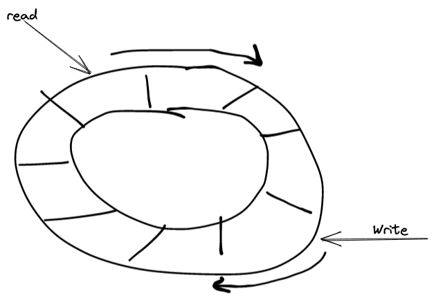

# Learning Objectives

At the end of this lecture, you should be able to:
- Define pipes and the way they are implemented in the OS.
- Use pipes to allow for exchange of information between processes. 

---

# Topics

In this lecture, we will cover the following topics:
- Unix pipes.

---

# Notes


<!-- vim-markdown-toc GFM -->

* [Motivation](#motivation)
* [Pipes](#pipes)
  * [Implementation](#implementation)
  * [Usage](#usage)
  * [Example](#example)
  * [Edge Cases](#edge-cases)

<!-- vim-markdown-toc -->

# Motivation

- By default, processes are isolated from one another. One process cannot read
  data that is in another process's address space. 
  - :question: Why would we want to do that?
- As much as we would like processes to be completed isolated, we must allow
  them some forms of communication. 
  - :question: If you were designing your OS now, how would you implement
    inter-process communication?
- So far, we have seen one way for processes to communicate with each other, and
  that is through using signals.
  - However, signals cannot carry too much information, only notifications.

# Pipes

- Pipes are in-memory files that allow for data communication between related
  processes in a first-in-first-out fashion.
- In fact, processes can communicate without even knowing who is on the other
  end of the pipe. 
  - Kind of like a tunnel where someone is shouting on the other end, you can
    hear them but you cannot really know who they are.
- In this class, we will focus on __unnamed__ pipes, named pipes are beyond what
  we will cover here. 

- __Definition__: A pipe is a __unidrectional__ channel of communication between
  two or more processes that share an ancestor that has set up a pipe.
  - All descendants of that ancestor will share access to that pipe.
    

## Implementation

- Behind the scenes, the operating system implements a pipe as a virtual file in
  memory.
  - In other words, the file does not exist on the disk, and after it is closed,
    its content are lost.
- The process wishing to communicate will maintain file pointers to that
  in-memory file, typically using file descriptors represented by integers.
  - Similar to what we get when we open a file in Linux using `fd = open(...)`.

- A pipe's in-memory file is implemented as a circular array of characters.
  - The pipe file's data structure maintains two pointers:
    1. A read pointer from which to read the next character.
    2. A write pointer where to write the next character.
  

## Usage

- To create a pipe, a process can use the `pipe()` function that takes as
  argument an array of two integers.
  - The first element of that array will be the __reading__ end of the pipe.
  - The second element of that array will be the __writing__ end of the pipe.
- To read or write to a pipe, you can use the appropriate `read` and `write`
  system calls using the corresponding end of the pipe.

## Example

- Here is an example of creating a pipe and reading/writing data to it.
  ```c
  int fd[2];
  pipe(fd);

  if(fork() == 0) {
    /* this child is the writer, so it must close the reading end */
    close(fd[0]);

    const char *msg = "hello world!";
    write(fd[1], msg, strlen(msg));
    close(fd[1]);
    exit(0);
  } else {
    /* the parent is the reader, so it must close the writing end */
    close(fd[1]);

    char buff[512];
    if(read(fd[0], buff, 512) > 0) {
      printf("Read %s from pipe\n", buff);
    }
    close(fd[0]);
  }
  ```

## Edge Cases

- There are 4 cases that might arise when dealing with a pipe:
  1. Reading from a pipe that has enough data in it:
    - All is well and everything is good.
  2. Writing to a pipe that has enough space in it:
    - All is well and everything is good.
  3. Reading from an empty pipe, the calling process will sleep until one of the
     following conditions happen:
    - Someone writes to the pipe, then `read` returns the number of bytes
      read.
    - All writing ends are closed, and then `read` returns 0.
  4. Writing to a full pipe, the calling process will sleep until:
      : Someone reads from the pipe and then there is enough room in the pipe.
    - All reading ends are closed, the kernel will send the process the
      `SIGPIPE` signal (though this behavior can be overridden).


