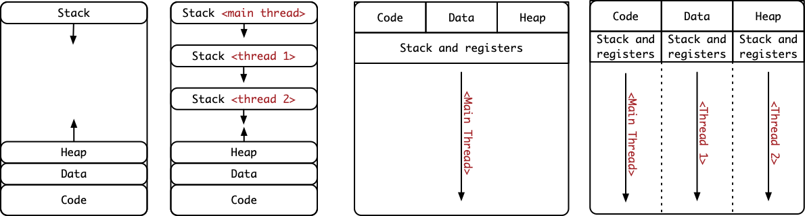

# Learning Objectives

At the end of this lecture, you should be able to:

- Clearly define the difference between multi-threading and multi-processing.
- Explain the advantages of multi-threading over multi-processing and identify
  when each approach would be most suitable.
- Implement multi-threaded code using the `pthreads` library.

---

# Topics

In this lecture, we will cover the following topics:

- Multi-threading and multi-processing.
- The `pthreads` library.
- Introduction to concurrency issues.

---

# Notes

<!-- vim-markdown-toc GFM -->

* [Motivation](#motivation)
* [Multi-threading vs. multi-processing](#multi-threading-vs-multi-processing)
  * [Example](#example)
* [Introduction to `pthreads`](#introduction-to-pthreads)
  * [Thread creation](#thread-creation)
  * [Thread joining](#thread-joining)
  * [Thread functions and returns](#thread-functions-and-returns)
* [Activity](#activity)
  * [`thread_example.c`](#thread_examplec)
  * [`threadSpeedTest.c`](#threadspeedtestc)

<!-- vim-markdown-toc -->

# Motivation

- Let’s go back to our previous example of the CSSE332 shop
- Let’s say you are getting way too many students and it is now time to expand
- Even worse, the annoying student Robert is back with his friends, Sid and
  Sriram, and they have tons of questions
- What would you do in that case? How would you scale up to maintain a good
  business and make more profit?
  - One thing to do is to clone the shop and use the separate clone as a
    completely separate process, with its own memory, its own books, and so on
  - This also has a high cost in high maintenance (keep separate books,
    coordinate between branches, inter-branch communication, ...)
  - The other option, which is probably better to do initially, is to hire more
    instructors that use the shared space available in the same shop
  - Each instructor will have their own mind, their own students to work with,
    but they will share the shop, the books, and so on.

# Multi-threading vs. multi-processing

- What we have been doing so far and until exam 1 is multi-processing
- We use `fork` to clone the current process and create one with a separate
  address space, separate registers, separate code, data, heap, and stack regions
- That is expensive since every time we create a process, we incur the penalty
  of cloning the address space, the code, the data, and the heap segments of
  memory
- Another approach is to use **multi-threading**
- Decompose one process into multiple threads of control (or threads of
  execution) that
  1. Share the Code, Data, and Heap sections
  2. Have their stack and their own registers
- The same process will now have multiple threads of control, i.e., multiple
  points of execution and thus multiple program counters!



- Each process initially has one thread of control, but we can create many more
  for the same process

## Example

- Can you think of examples where you’d want to use this approach over multi-processing?
  - Think of video games, web servers, database servers, etc.
- For example, in a webserver, there is a thread that waits for incoming
  requests.
  - Once a request arrives, the waiting thread accepts it and assign the
    customer to a specific thread of execution
  - The assigned thread of control will take care of that specific customer
    instead of blocking the waiting thread
  - The waiting thread can then go back to waiting for other customers to come
    in.
- This results in kind of like tree structure of light-weight threads compared
  to full blown processes.
- So the benefits of multi-threading can be summed up in two principles:
  - Easy and light-weight parallelism
  - Avoid blocking a program due to slow I/O

# Introduction to `pthreads`

- `pthreads` is an implementation of the POSIX standard for multi-threading
- POSIX specifies a set of interfaces and header file for creating and managing
  threads
- Threads share global memory (data and heap)
- Each thread has its own stack and registers

## Thread creation

- Each thread is associate with some code that it must execute
  - However, note that code for all threads resides in the same Code region in
    memory.
- How can we achieve that in C?
  - Yes, function pointers
- Example:

```c
void *function(void *arg) {
	int tid = *(int *)arg;
	printf("Hello from thread %d\n", tid);
	return NULL;
}

pthread_t thread;
int i = 7;
pthread_create(&thread, NULL, function, &i);
```

- Be very careful what you pass to the thread creation function
- For example, this is very very very bad

```c
pthread_t threads[7];
for(int i = 0;i < 7; i++) {
	pthread_create(&threads[i], NULL, function, &i); // why is this bad?
}
```

- Never forget about the main thread, this is what refer to as the parent or the
  main thread, which is the one that created the threads.
- For example, if I use `pthread_create` once, I end up with two threads:
  - The main thread that called `pthread_create`
  - The new thread that will execute the function

## Thread joining

- When we create threads, we need a way for us to wait for them to complete
  execution and then free up the resources that they are using
- Think of this in a similar wait to `fork` and `wait` in multi-processing
- To achieve that end, we call the process of waiting for threads to complete
  execution is the process of **thread joining**.

```c
int *result = malloc(sizeof(int));
pthread_join(thread, (void**)&result);

free(result);
```

- Wait what is this `result`? Well what if the thread wanted to return something
  to us?
- How did we do that in the case of multi-processing? Yes, using the exit status
  and pipes
- In multi-threading, you can fill any data structure that is on the heap and
  return the address of it to the parent
- Be aware not to return the address of something on the thread’s stack, why?

## Thread functions and returns

- To return from a thread function, we can do one of two things:

```c
return NULL;
```

- or

```c
pthread_exit((void*)my_result);
```

- In this class, we’re almost always not returning anything from the thread
  functions, all communication will happen through the shared memory between the
  parent thread and its children.

# Activity

## `thread_example.c`

- Let’s start off with an example and take a look inside `thread_example.c`
- What are we trying to achieve in this case?
- Observe that each thread will have its own address of `i`, so each thread will
  print a different address
- Each thread is trying to add 1 `max` times to a counter variable.
- Let’s try to run this several times and see what we get
- Notice that once we get to a large number, the result of our addition deviates
  from the expected answer. Why?
- Let’s take a closer look and examine what is happening
- The code `counter = counter + 1` results in the following instructions in
  assembly (assuming MIPS):

```asm
la    $t0, counter
lw    $t1, 0($t0)
addi  $t1, $t1, 1
sw    $t1, 0($t0)
```

- There is no guarantee that whenever any of these instructions execute, the
  thread will be preempted by the schedule and the other thread will start
  execution
- When is the absolute worst time for the scheduler to preempt us?
  - It will most likely preempt us at that time!
- We’ll talk more about this on Thursday

## `threadSpeedTest.c`

- In this example, we are going to try and benchmark the runtime of a program as
  we run sequentially, using multiple processes, and using multiple threads.
- Your job is to change the code so that it run two `pthreads` in parallel to
accomplish the given task
