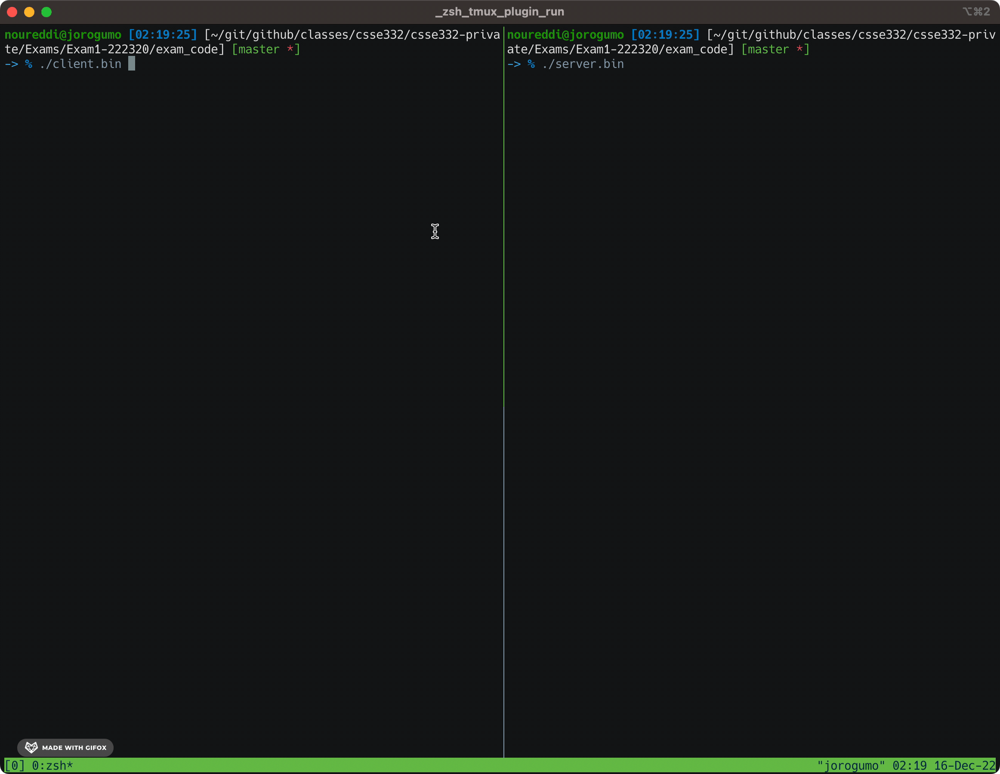
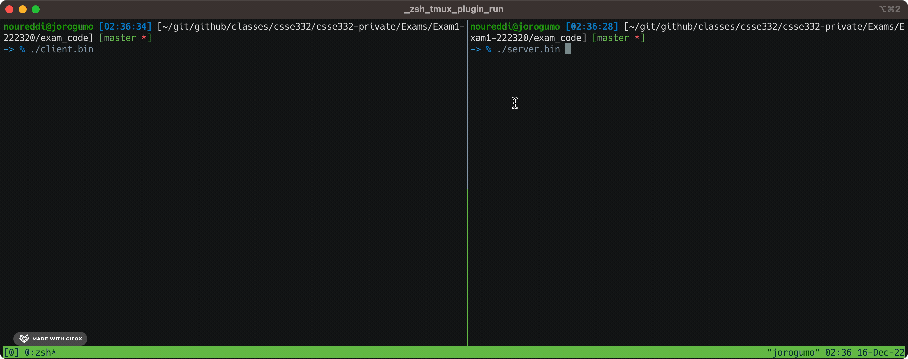
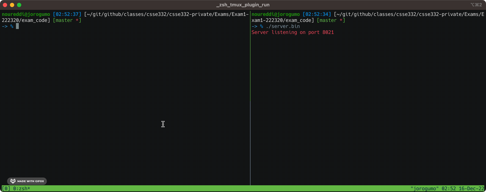
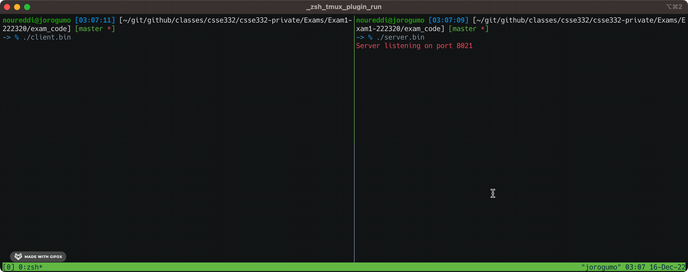

# CSSE332 Exam 1 Winter 2022-23

# Part 1: Introduction

In this exam, we will implement a remote execution server that uses
multi-processing to support multiple clients connecting to it simultaneously,
very much similar to a [Telnet](https://en.wikipedia.org/wiki/Telnet) server. A
client can connect to our server and use it to execute remote commands on the
server. This is defintely a terrible idea since giving the client the abiltiy to
execute arbitrary remote commands on our server is dangerous, but we'll assume
we're only dealing with trusted clients for the purposes of this exam.

All of your implementation should happen in the `server.c` file and you should
not be changing any of the code in any of the other files that we provide you
with. They are there to help hide some of the details of implementing the server
away from you so you can solely focus on the multi-processing aspect of it.

Your toolbox for this exam shall consist of the following function calls:
`fork`, `execlp`, `wait`, `waitpid`, `pipe`, `read`, `write`, and `kill`. Those
should be enough to handle all the following implementation steps. 

# Step 0: Compile and Run the Code

For the best results in this exam, you will need __at least__ two open terminal
windows, one that is to be used for the server, and another that is to be used
for the client(s). In the sample code that follows, the `(server) $` prompt
signifies that the command should be run on the server terminal, while the
`(client) $` prompt signifies that the command should be run on the client
terminal.

To compile the code, first `cd` into the directory for part 1 and then use
`make` to compile the code. Three binaries should show up:
- `server.bin`: This is the main executable for the server side. This is the one
  you will be changing the source code for.
- `client.bin`: This is the executable for the client side. You will not need to
  make any modifications to the client files.
- `loopy.bin`: This is a simple executable that runs forever in a `while(1);`
  loop. You shall not need to modify the code for `loopy.c`.

First, let's just get familiar with running the server and the client binaries.
In one terminal, run the server using:

```shell
(server) $ ./server.bin
Server listening on port 8021
```
And in another terminal, launch the client using

```shell
(client) $ ./client.bin
Client connected to server at port 8021
CLIENT (498056) %%
```

Note that the number 498056 is the child process's PID and will be different in
your case.

You can now enter commands in the client terminal, but they will have no effect
at all. Additionally, you can use `close` to close the connection from the
client to the server and terminate the `client.bin` process. On the other hand,
to terminate the `server.bin` process, send it the `SIGINT` signal by pressing
C-c (i.e., Ctrl + c) to cause it to terminate.



# Step 1: Accepting Client Requests

In the first step, we would like to add support for the client request
processing by the server. Whenever the server accepts a request from a client,
it should call the `service_request` function __in a separate process__. In
other words, for each client, the server will create a new child process that
will execute (by simply making a function call) the function
`service_request(ns, client, 0);`. 

The function `service_request` will ask the client to send commands to the
server until the client sends the `close` command at which point the client is
disconnected. However, during this time, the server __should be free__ to accept
new connections from other clients, i.e., the server should not block until the
first client has closed its connection, it should be free to bring in new
clients.  

To test this, first run the server using `./server.bin` and then open a client
terminal and launch the `client.bin` executable. Then enter any commands you
like and the server will simply echo those commands back as is (except for
`close` which close the connection). Here is an example:

```shell
(client) $ ./client.bin
Client connected to server at port 8021
CLIENT (499409) %% hi
CLIENT (499409) %% my name is client
CLIENT (499409) %% test message
CLIENT (499409) %% close
```

```shell
(server) $ ./server.bin
Server listening on port 8021
service_request(499410):        Accepted connection from client port 12489
Worker 499410 received hi from client
Worker 499410 received my name is client from client
Worker 499410 received test message from client
Worker 499410 received close from client
service_request(499410):        Closing connection from client port 12489
```

Here is a gif to show you the output in action:


# Step 2: Execute the Command Sent by the Client

In this next step, we would like our server to actually execute the commands
sent by the client. __For simplicity, we will assume that the client sends at
most one argument (in addition to the command's name)__. For that purpose, we
have provided you with the function `parse_client_comands(buff,
parsed_command);` which will place the command's path in `parsed_command[0]` and
the argument, if any, in `parsed_command[1]`. If there is no argument,
`parsed_command[1]` will be `NULL`. 

Your job in this step is to simply cause the worker process (i.e., the one
executing `service_request`) to actually execute the command sent by the client
to the server. For that purpose, you will need to make use of one of the
variants of the `exec` system call. Note that in this step, your worker process
should only be able to execute one client command at a time. In other words, if
the client issues the command `sleep 5` (which cause the process to sleep for 5
seconds), then the worker process should not process any new commands until the
first one has completed and exited. This means that the commands sent by the
client execute in the __foreground__ and not in the background.

To test your code, first run the server on the server terminal using
`./server.bin` and then from the client side, issue the following commands:

```shell
(client) $ ./client.bin
Client connected to server at port 8021
CLIENT (499948) %% date
CLIENT (499948) %% sleep 2
CLIENT (499948) %% date
CLIENT (499948) %% close
```

At the server end, you should see

```shell
(server) $ ./server.bin
Server listening on port 8021
service_request(499949):        Accepted connection from client port 5253
Worker 499949 received date from client
Fri Dec 16 02:51:06 EST 2022
Worker 499949 received sleep 2 from client
######### There should be a 2 secconds daley before the next command shows up ############
Worker 499949 received date from client
Fri Dec 16 02:51:10 EST 2022
Worker 499949 received close from client
service_request(499949):        Closing connection from client port 5253
```

Here's another gif to help you see that:


# Step 3: Executing Background Commands

It is great that now the client can remotely execute foreground commands on the
server, but it is our desire to also allow for background commands, i.e.,
commands that the client can launch and then let me continue execution in the
background. The client can then launch other commands normally. 

To simplify things, when a client wants to send a background command, they will
pass the character `&` as the argument to the command they want to execute. For
example, if the client to execute the command `./loopy.bin` in the background,
then they will send the server the command `./loopy.bin &`. The server will then
parse that command and figure out that it is meant to be a background command
and execute it accordingly. 

To test your implementation, we have provided you with the `loopy.c` program
that simply loops forever. Your implementation works when you can launch
`./loopy.bin` in the background and then continue being able to issue new
commands from the client to the server. If your client looses the ability to run
new command after sending `./loopy.bin &` to the server, then your
implementation is incorrect. 

```shell
(server) $ ./server.bin
Server listening on port 8021
service_request(500400):        Accepted connection from client port 46768
Worker 500400 received ./loopy.bin & from client
Loopy looping forever...
Worker 500400 received date from client
Fri Dec 16 03:04:26 EST 2022
Worker 500400 received echo hello from client
hello
Worker 500400 received whoami from client
noureddi
Worker 500400 received close from client
service_request(500400):        Closing connection from client port 46768
```

```shell
(client) $ ./client.bin
Client connected to server at port 8021
CLIENT (500399) %% ./loopy.bin &
CLIENT (500399) %% date
CLIENT (500399) %% echo hello
CLIENT (500399) %% whoami
CLIENT (500399) %% close
```

Here's another gif to help you out:


# Step 4: Cleanup Child Processes

At this point, we are creating many child processes that we are not waiting on,
which causes us to create zombie children. We would like to avoid doing that as
much as possible and thus we would like the `close` command to send the
`SIGTERM` signal to all of the worker's children.

To send a signal to a specific process with ID `pid`, you can use the `kill`
function call as follows:

```c
kill(pid, SIGTERM);
/* now wait for the process to completely destroy it! */
waitpid(pid, 0, 0);
```

Modify the server code for the `close` command to send the `SIGTERM` signal to
all of its direct children when the `close` command is detected. 

> _Hint_: You might find it useful to keep track of the PIDs of all of your
directly forked children as well as the number of those children. 

> _Hint_: If you write more than 5 lines of code for this step, you are probably
overthinking it. 

To verify that your code is working correctly, first start the server in a
terminal window. Then from the client terminal, issue the `close` command and
then check the output of the `ps -a` utility. It should show something that
looks like the following:

```shell
(server) $ ./server.bin
Server listening on port 8021
service_request(501037):        Accepted connection from client port 63201
Worker 501037 received ./loopy.bin & from client
Loopy looping forever...
Worker 501037 received close from client
service_request(501037):        Closing connection from client port 63201
```

```shell
(client) $ ./client.bin
Client connected to server at port 8021
CLIENT (501036) %% ./loopy.bin &
CLIENT (501036) %% close
Client closing connection to server at port 8021

(client) $ ps -a
    PID TTY          TIME CMD
 498562 pts/1    00:00:00 tmux: client
 501035 pts/2    00:00:00 server.bin
 501037 pts/2    00:00:00 server.bin <defunct>
 501039 pts/2    00:00:05 loopy.bin

(client) $ pstree -s 501039
systemd───loopy.bin
```

Two important things to note here:
1. There still exists a zombie process `server.bin <defunct>`, that process is
   in fact __not__ a direct child of the worker process handling our client. It
   is actually the worker process itself! Recall that in step 1, we did not
   require you to wait for any newly created processes, and thus any process
   created in step 1 (i.e., those that simply call the `service_request`
   function call) will become a zombie process. For the purposes of this exam,
   __we will accept the presence of those zombies__.
2. Note that the `loopy.bin` program that the client launched in the background
   in its first command is actually still running. However, it became orphaned
   and has then been adopted by `systemd` as show in the output of the `pstree`
   command above. We will take care of those orphans in the next step.

# Step 5: Removing Orphaned Processes

As mentioned at the end of the previous step, our current implementation of the
`close` command leaves out orphaned processes. Those are the grandchildren of
the worker processes handling client requests, and are orphaned when the worker
process kills its children upon a `close` command.

In this step, we would like the `close` command to propagate to all children and
grandchildren that have been created by the client, and thus must not produce
any orphaned processes. 

To do so, any child that receives the `SIGTERM` signal from its parent must then
kill all of its own children by propagating the `SIGTERM` signal to them. Once
you implement that, redo the same testing operation as the previous case, and
the `loopy.bin` orphaned processes should disappear.

```shell
(server) $ ./server.bin
Server listening on port 8021
service_request(501351):        Accepted connection from client port 11974
Worker 501351 received ./loopy.bin & from client
Loopy looping forever...
Worker 501351 received ./loopy.bin & from client
Loopy looping forever...
Worker 501351 received ./loopy.bin & from client
Loopy looping forever...
Worker 501351 received close from client
service_request(501351):        Closing connection from client port 11974
```

```shell
(client) $ ./client.bin
Client connected to server at port 8021
CLIENT (501350) %% ./loopy.bin &
CLIENT (501350) %% ./loopy.bin &
CLIENT (501350) %% ./loopy.bin &
CLIENT (501350) %% close
Client closing connection to server at port 8021

(client) $ ps -a
    PID TTY          TIME CMD
 498562 pts/1    00:00:00 tmux: client
 501347 pts/2    00:00:00 server.bin
 501351 pts/2    00:00:00 server.bin <defunct>
```

> _Hint_: You might find it useful to alter the behavior of some processes when
they receive the `SIGTERM` signal.


# Step 6: Server Logging

In this final step, we would like our server to keep a log of the actions of all
of the clients that it has serviced, and the dump that log to the console before
it is terminated using the `SIGINT` signal. To do that we will make use of Unix
pipes. 

Every time a client connects to your server, you should create a pipe between
the original server parent and the new worker process. Next, every time the
worker process receives a new command from the client, it must log this command
to the pipe. Finally, when the main parent process receives the `SIGINT` signal,
it will read all of the lines in the pipe and print them out to the console. 

To make things easier for you, I have already provided you with the code that
creates the log messages in the following snippet:

```c
purple();
llen = sprintf(log, "Worker %d received %s from client\n", getpid(), buff);
log[llen] = '\0';
printf("%s", log);
```

Here's a possible plan of attack for this problem:
- Create a pipe between the main parent and every worker process. 
- Pass the writing file descriptor of that pipe as the third parameter of the
  `service_request` function call. 
- Write the log message to the pipe every time you receive a message from the
  client. 
- Keep track of all the pipes you have created so far.
- Override the `SIGINT` signal handler in the main parent process.
- Print all the content of all the pipes into the console. 

A possible output for a sample run would go as follows:
```shell
(server) $ ./server.bin
Server listening on port 8021
service_request(502347):        Accepted connection from client port 10430
Worker 502347 received echo hi from client
hi
Worker 502347 received echo hello from client
hello
Worker 502347 received whoami from client
noureddi
Worker 502347 received date from client
Fri Dec 16 04:00:22 EST 2022
Worker 502347 received sleep 1 from client
Worker 502347 received date from client
Fri Dec 16 04:00:25 EST 2022
Worker 502347 received close from client
service_request(502347):        Closing connection from client port 10430
########## I pressed Ctrl-c here #############
^CWorker 502347 received echo hi from client
Worker 502347 received echo hello from client
Worker 502347 received whoami from client
Worker 502347 received date from client
Worker 502347 received sleep 1 from client
Worker 502347 received date from client
Worker 502347 received close from client
```

with the corresponding client output:

```shell
(client) $ ./client.bin
Client connected to server at port 8021
CLIENT (502346) %% echo hi
CLIENT (502346) %% echo hello
CLIENT (502346) %% whoami
CLIENT (502346) %% date
CLIENT (502346) %% sleep 1
CLIENT (502346) %% date
CLIENT (502346) %% close
Client closing connection to server at port 8021
```

# Part 2: xv6 (Not really)

After a conversation with my wife about the length of this exam and its
difficulty, she convinced me to remove the xv6 part out of the exam to give you
folks a bit more time to keep your focus on one thing and not distract you with
another task that might seem detached. Therefore, that's all folks. Hope you did
well on the first part. 

